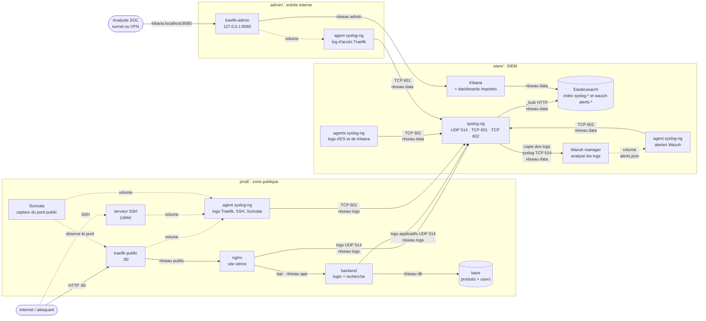

# Système de détection d'anomalies et de gestion de logs

Projet pratique 1 — 8INF857. Un petit SIEM qui collecte les logs d'un réseau
simulé, les analyse pour détecter des intrusions, les stocke, les visualise, et
notifie l'administrateur sur un cas confirmé.

## Objectif

Monter une chaîne complète **collecte → détection → stockage → visualisation →
alerte**, puis la mettre à l'épreuve avec cinq familles d'attaques et montrer
leur détection.

## Outils

| Rôle | Outil |
|---|---|
| IDS/IPS | **Wazuh** (manager) + **Suricata** (capteur réseau) |
| Collecteur de logs | **syslog-ng** |
| Base de données | **Elasticsearch** |
| Visualisation | **Kibana** |

Choix assumé : **une seule base, Elasticsearch**. On n'installe ni le Wazuh
indexer ni le Wazuh dashboard — Wazuh se limite au *manager* et ses alertes sont
poussées dans Elasticsearch par syslog-ng (voir [`siem/wazuh/README.md`](siem/wazuh/README.md)).

## Architecture

Le labo est découpé en **zones réseau isolées** : un service ne peut joindre que
ce dont il a besoin. Toutes les sources envoient leurs logs au **syslog-ng
central**, qui en garde une copie dans Elasticsearch (`syslog-*`) et en envoie
une autre à Wazuh ; les alertes de Wazuh repartent dans Elasticsearch
(`wazuh-alerts-4.x-*`) et s'affichent dans Kibana.



Le fichier source du schéma : [`architecture.mmd`](architecture.mmd).

## Structure du dépôt

```
docker-compose.yml     # la carte : inclut les 3 zones et déclare les réseaux
prod/                  # zone publique : traefik, nginx, backend, base, ssh, suricata
admin/                 # entrée interne : traefik-admin -> Kibana (loopback)
siem/                  # le SIEM : syslog-ng, Elasticsearch, Kibana, Wazuh, agents
  elasticsearch/  kibana/  syslog-ng/  wazuh/  kibana-export/
attacks/               # red team : 5 familles x 2 scénarios + run.sh
docs/                  # cette documentation
```

## Démarrage

Prérequis et vérifications détaillés : [`docs/INSTALLATION.md`](docs/INSTALLATION.md).

```sh
docker compose up -d        # ou : podman compose up -d
```

Puis, depuis la machine hôte :

- **Kibana** : http://kibana.localhost:8080 (via Traefik admin, loopback seulement)
- **Site attaqué** : http://localhost
- **Serveur SSH cible** : `ssh -p 2222 sysadmin@localhost`

## Tester et visualiser

- Jouer les attaques : [`docs/UTILISATION.md`](docs/UTILISATION.md) et [`attacks/README.md`](attacks/README.md).
- Lire les dashboards : [`docs/VISUALISATION.md`](docs/VISUALISATION.md).
- Analyse, limites et perspectives : [`docs/CONCLUSION.md`](docs/CONCLUSION.md).
