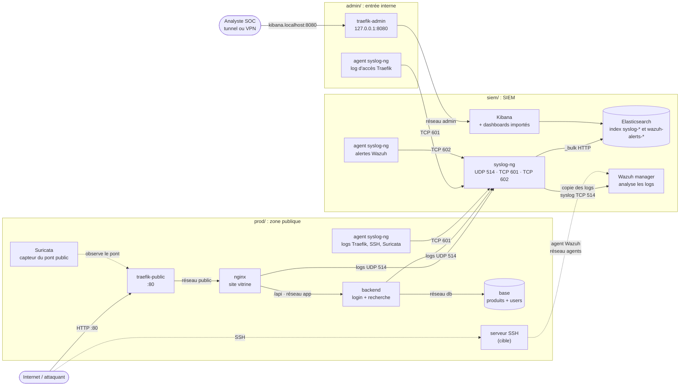

# Projet pratique 1 — Détection d'anomalies et gestion de logs (8INF857)

DUBOIS Emmanuel (DUBE28070400), FRUME Nathan (FRUN12070300), MERLO Johan (MERJ04070500), GIRARDY Raphaël (GIRR16040500)

## Le projet

On a monté un petit SIEM, entièrement avec Docker, qui simule un réseau
d'entreprise et surveille ce qui s'y passe. La chaîne va de la collecte des logs
jusqu'à l'alerte : tout est récupéré par un collecteur central, stocké, analysé
pour lever des alertes, affiché dans Kibana, et un courriel part quand un
incident est confirmé.

Une fois la plateforme en place, on l'a attaquée nous-mêmes (red team) avec cinq
familles d'attaques, puis on a regardé ce que la défense arrivait vraiment à voir
(blue team). C'est la partie la plus intéressante du projet : un SIEM ne détecte
que ce qu'on lui a appris à chercher, et plusieurs attaques sont restées
invisibles tant qu'on n'avait pas écrit la règle qui va avec. On revient
là-dessus dans la conclusion.

## Architecture

Le réseau est découpé en zones isolées : un service ne peut joindre que ce dont
il a besoin. On l'a vérifié depuis la zone publique — Elasticsearch, Kibana et la
base ne sont pas joignables ; le seul passage vers le SIEM est l'agent du serveur
SSH, qui parle au manager Wazuh et à rien d'autre.



Les logs suivent tous le même chemin : chaque service a, posé à côté de lui, un
conteneur syslog-ng « sidecar » qui partage son volume de logs et les renvoie au
syslog-ng central du SIEM. De là, une copie part dans Elasticsearch (index
`syslog-*`) et une autre vers Wazuh, qui analyse et renvoie ses alertes dans
Elasticsearch (index `wazuh-alerts-4.x-*`). Kibana lit les deux. Le schéma source
est dans [`architecture.mmd`](architecture.mmd).

### Les services, et pourquoi on les a pris

En plus des services imposés (syslog-ng, Elasticsearch, Kibana) :

- **Wazuh** plutôt que Snort, parce que plusieurs d'entre nous avaient déjà
  travaillé avec.
- **Suricata**, suggéré dans l'énoncé, pour ajouter des règles réseau par-dessus
  Wazuh (on charge le jeu ET Open, ~53 000 règles).
- **Traefik** en entrée, qui nous sert à la fois de reverse proxy et de source de
  logs en plus.

On a aussi ajouté des cibles pour les attaques : un site nginx avec un backend
(login et recherche dans une base) et un serveur SSH.

> **Suricata sous Podman / Docker rootless** : il ne peut pas écouter l'interface
> physique de l'hôte (permissions), on le branche donc directement sur le pont de
> nginx/Traefik. Conséquence : les familles 1 et 2, qui reposent sur ses
> signatures, ne remontent que sous Docker.

## Lancer le projet

Il faut Docker avec Compose (ou Podman) et une connexion Internet — les images
viennent du Docker Hub, il n'y a rien à installer à la main.

```sh
docker compose up -d        # ou : podman compose up -d
```

Ensuite, depuis l'hôte :

- **Kibana** : http://kibana.localhost:8080 (via le Traefik admin, boucle locale)
- **Site attaqué** : http://localhost
- **Serveur SSH cible** : `ssh -p 2222 sysadmin@localhost`

Le détail et les vérifications service par service sont dans
[`docs/INSTALLATION.md`](docs/INSTALLATION.md).

## Tester et visualiser

- Jouer les attaques : [`docs/UTILISATION.md`](docs/UTILISATION.md) et
  [`attacks/README.md`](attacks/README.md) (avec la justification de chaque
  famille).
- Lire les tableaux de bord : [`docs/VISUALISATION.md`](docs/VISUALISATION.md).
- Analyse, limites et pistes d'amélioration :
  [`docs/CONCLUSION.md`](docs/CONCLUSION.md).

## Structure du dépôt

```
docker-compose.yml     # la carte : inclut les 3 zones et déclare les réseaux
prod/                  # zone publique : traefik, nginx, backend, base, ssh, suricata
admin/                 # entrée interne : traefik-admin -> Kibana (loopback)
siem/                  # le SIEM : syslog-ng, Elasticsearch, Kibana, Wazuh, agents
  elasticsearch/  kibana/  syslog-ng/  wazuh/  kibana-export/
attacks/               # red team : 5 familles x 2 scénarios + run.sh
docs/                  # cette documentation
```

## Utilisation de l'intelligence artificielle

Ce travail a été réalisé avec l'aide d'une IA générative. Une partie du contenu
(code, configuration et documentation) a été produite ou reformulée avec son
aide, puis relue et adaptée par l'équipe.
