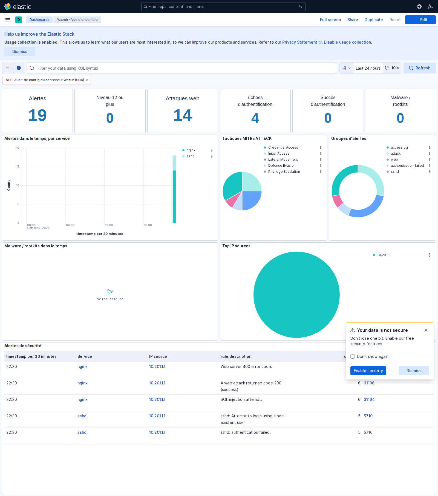
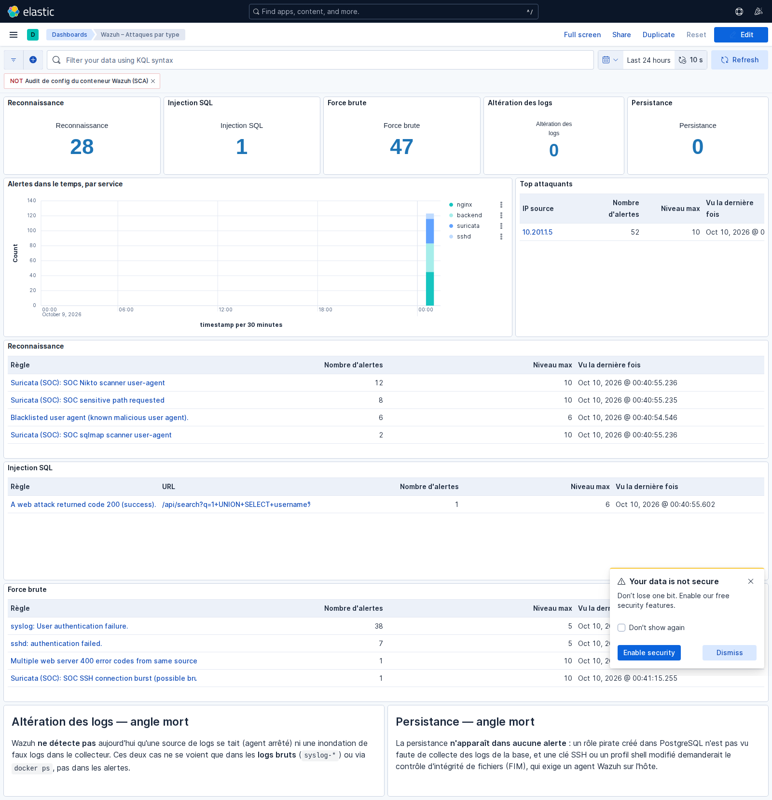
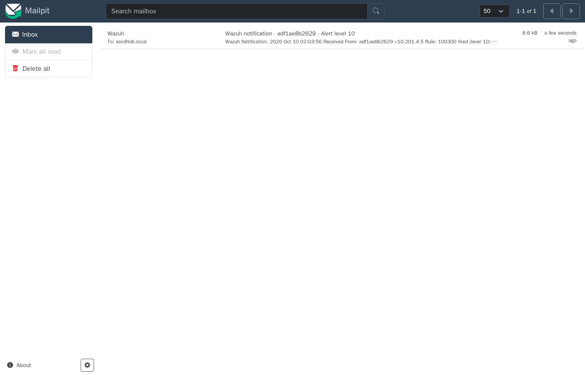

# Visualisation (Kibana)

Toute la visualisation passe par **Kibana**, servi sur la boucle locale via le
Traefik admin : **http://kibana.localhost:8080**. Les dashboards et les *data
views* sont importés automatiquement au démarrage (`kibana-setup`).

## Dashboard « Wazuh – Vue d'ensemble »

La vue SOC générale, sur l'index des alertes `wazuh-alerts-4.x-*`.

Comment la lire :

- **Les tuiles du haut** : nombre total d'alertes, alertes de niveau ≥ 12,
  échecs et succès d'authentification, activité malware. Un coup d'œil sur l'état.
- **Alertes dans le temps, par service** : qui génère des alertes et quand ; un
  pic signale une rafale d'activité.
- **Top MITRE ATT&CK** : les tactiques des attaquants (accès initial, accès aux
  identifiants…), utile pour qualifier la menace.
- **Tableau des alertes** : le détail (règle, niveau, service, horodatage).
- Un **filtre** « NOT ... SCA » masque l'auto-audit que le manager fait de son
  propre conteneur (du bruit, pas une menace) ; un clic le réactive.

## Dashboard « Wazuh – Attaques par type »

Une vue **condensée** : les alertes sont **agrégées**, donc une ligne correspond
à un type d'incident, et non aux dizaines de logs qu'une seule attaque génère.

Comment la lire :

- **Cinq tuiles**, une par famille d'attaque (reconnaissance, injection SQL,
  force brute, altération des logs, persistance). Les deux dernières à **0** :
  ce sont les angles morts actuels (voir [CONCLUSION](CONCLUSION.md)), affichés
  volontairement pour montrer ce que le SIEM *ne voit pas encore*.
- **Tableaux condensés par famille** : par exemple « 12 × scan Nikto, niveau 10,
  dernière fois à … » sur une ligne, au lieu de douze alertes séparées.
- **Top attaquants** : les IP sources les plus actives.
- **Deux encarts « angle mort »** rappellent pourquoi l'altération des logs et la
  persistance n'apparaissent pas dans les alertes.

## Notification par courriel

Sur une intrusion confirmée (alerte de niveau ≥ 10), Wazuh envoie un courriel,
reçu dans le labo par **Mailpit** (http://127.0.0.1:8025).

Le mail contient la règle déclenchée, son niveau et l'extrait de log —
l'administrateur sait immédiatement quoi regarder.

> Les captures ci-dessus ont été prises après un jeu d'attaques de démonstration ;
> les chiffres varient selon ce qui a été joué. Le bandeau « Your data is not
> secure » de Kibana est un simple message de session (sécurité désactivée en
> labo) et disparaît d'un clic.
