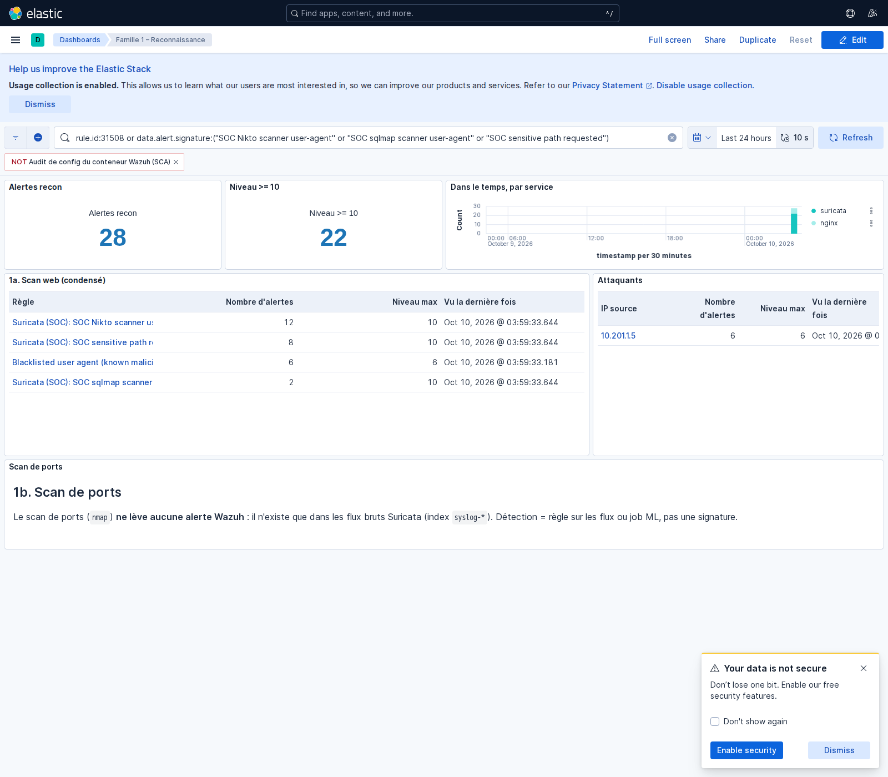
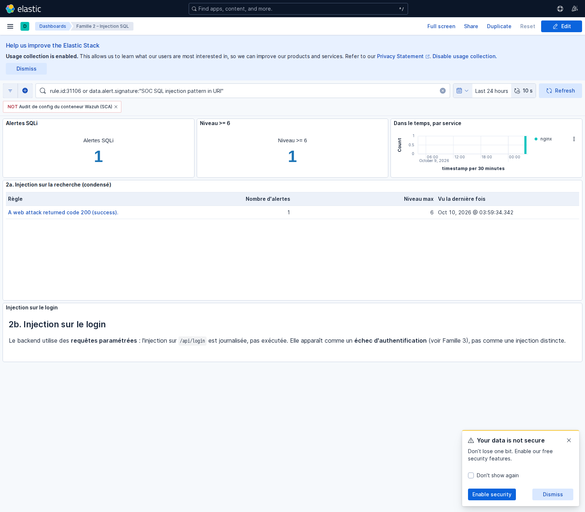
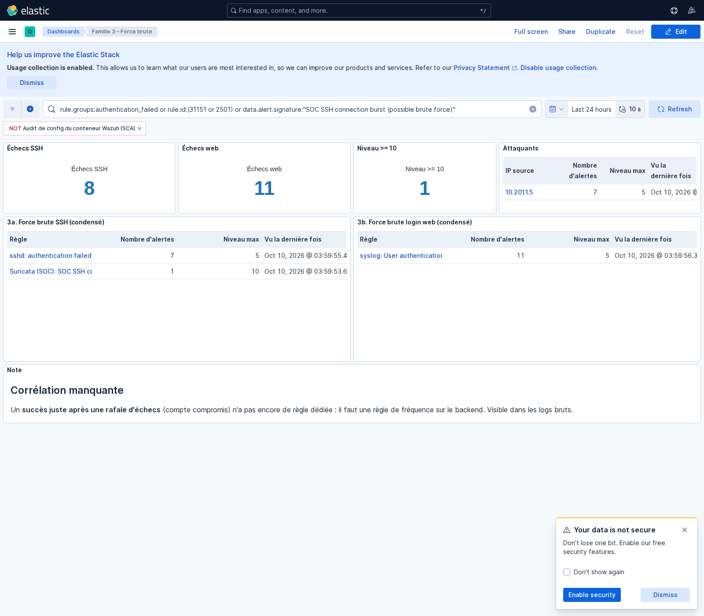
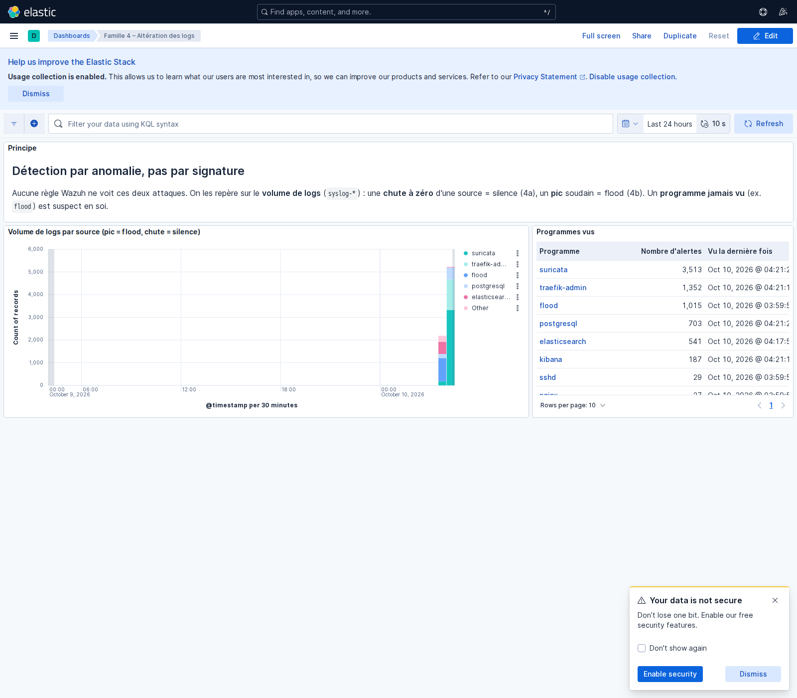
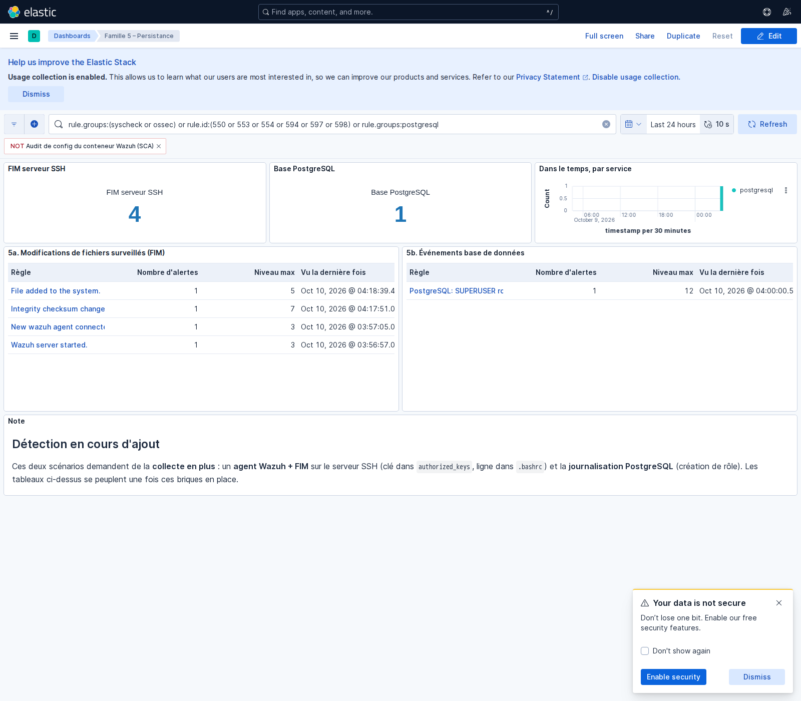
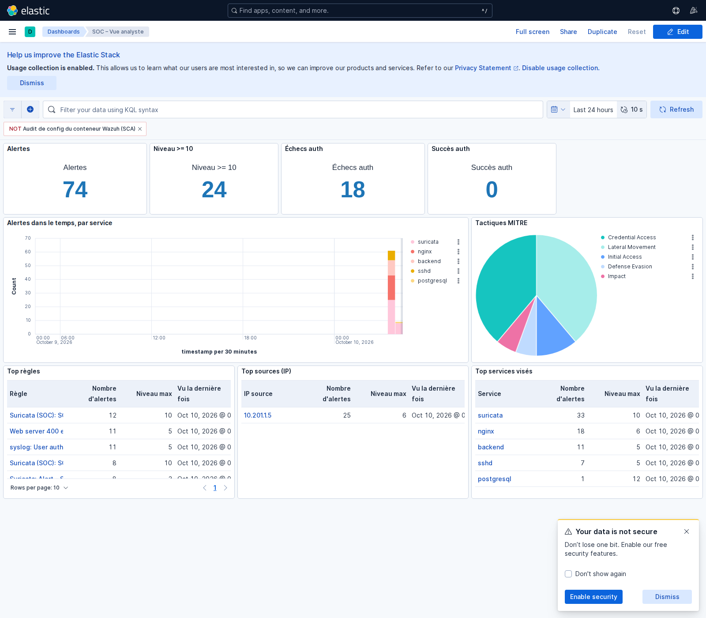

# Visualisation (Kibana)

Toute la visualisation passe par Kibana, servi sur la boucle locale derrière le
Traefik admin : http://kibana.localhost:8080. Les tableaux de bord et les *data
views* sont importés tout seuls au démarrage (le service `kibana-setup` charge
tous les fichiers de `siem/kibana-export/`).

On a six tableaux de bord : un par famille d'attaque, plus une vue analyste
globale.

## Un tableau de bord par famille

Cinq dashboards, de `Famille 1 – Reconnaissance` à `Famille 5 – Persistance`.
Chacun ne montre que sa famille : quelques compteurs en haut, l'activité dans le
temps par service, et un tableau **condensé** par sous-scénario (une ligne = un
type d'incident, et pas les dizaines de logs qu'une seule attaque génère).

Ils lisent tous l'index des alertes `wazuh-alerts-4.x-*`, **sauf** « Famille 4 –
Altération des logs ». C'est volontaire : un conteneur qui se tait ou qui inonde
ne produit *aucune* alerte, donc il n'y a rien à afficher côté alertes. Ce
dashboard lit à la place les logs bruts `syslog-*` et montre le **volume par
source dans le temps** — un pic trahit l'inondation, une chute le silence.

*Reconnaissance : le scan web (Nikto, sqlmap, chemins sensibles) détecté par Suricata.*

*Injection SQL : l'injection sur la recherche est vue (« web attack 200 ») ; celle sur le login apparaît comme un échec d'authentification, pas comme une injection.*

*Force brute : les échecs d'authentification SSH et web, et la rafale SSH.*

*Altération des logs : le programme `flood` (≈ 1000 lignes d'un coup) ressort dans « Programmes vus » — détection par anomalie, sans aucune règle.*

*Persistance : le FIM détecte la clé ajoutée (règle 554) et le `.bashrc` modifié (règle 550) ; la création du rôle SUPERUSER PostgreSQL remonte en niveau 12.*

## Le tableau de bord « SOC – Vue analyste »

C'est la vue d'ensemble, centrée sur les alertes (`wazuh-alerts-4.x-*`). Elle
sert à avoir l'état général en un coup d'œil, puis à pivoter vers l'enquête :

- des compteurs en haut : total d'alertes, alertes de niveau ≥ 10, échecs et
  succès d'authentification ;
- les alertes dans le temps par service, pour repérer une rafale ;
- les tactiques MITRE ATT&CK, pour qualifier la menace (accès initial, accès aux
  identifiants, persistance…) ;
- le top des règles, des IP sources et des services visés.

Un filtre « NOT … SCA » masque l'auto-audit que le manager Wazuh fait de son
propre conteneur (du bruit, pas une menace) ; un clic le réactive.

*Vue analyste : 74 alertes, dont 24 de niveau ≥ 10 ; frise par service, tactiques MITRE, et le top des règles / sources / services visés.*

## La notification par courriel

Sur un incident confirmé, Wazuh envoie un courriel, qu'on reçoit dans le labo via
Mailpit (http://127.0.0.1:8025), un collecteur sans compte ni serveur externe.

L'envoi est volontairement ciblé : au-delà du seuil global (niveau ≥ 12), un mail
part sur la force brute qui aboutit (compte compromis) et sur la création d'un
rôle/superutilisateur en base. Un simple hit de scan (niveau 10) ne déclenche pas
de mail — il reste consultable dans Kibana — pour ne pas vider le quota horaire
pendant une rafale. Le mail contient la règle, son niveau et l'extrait de log,
donc on sait tout de suite quoi aller regarder.

> Les captures ont été prises après un jeu d'attaques de démonstration ; les
> chiffres changent selon ce qui a été joué. Le bandeau « Your data is not
> secure » de Kibana est juste un message de session (sécurité désactivée en
> labo) et part d'un clic.
